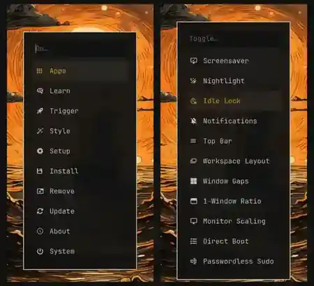

Six months ago, I was interested in tiling window managers but had no idea whether I would actually enjoy using one.

I had seen the videos. Hyprland looked beautiful. Windows opened exactly where they were supposed to, workspaces moved smoothly, and people seemed to control their entire computers without repeatedly reaching for the mouse.

The appeal was obvious.

The path to getting there was not.

A normal desktop environment gives you a complete desktop. Install GNOME or KDE Plasma and you already have a panel, launcher, notifications, lock screen, network controls, Bluetooth controls, screenshot tools, file manager and sensible default applications.

Install a tiling window manager and you often receive the foundation for managing windows. The rest becomes your responsibility.

That is excellent when you already know exactly what you want. It is a terrible starting point when you are still trying to discover whether you even like tiling.

This is why I now think [Omarchy](https://omarchy.org/) is one of the best ways to try a tiling window manager for the first time.

Not because every decision Omarchy makes is correct. It is not.

It is useful because it makes enough decisions for you that your first experience is about **using a tiling window manager**, not assembling one.

## I Wanted to Try a Tiling Window Manager, Not Build a Desktop

The biggest problem with trying Hyprland directly is not installing Hyprland. The problem is everything that comes after it.

You need to decide which bar to use, how notifications should work, which application launcher you prefer, how the lock screen should look, how screenshots should be captured, how clipboard history should work, how idle behaviour should be configured, and which shortcuts should control every part of the system.

Then you enter the dotfile rabbit hole.

You find a configuration that looks good on Reddit or YouTube. It has hundreds of files, references scripts you do not understand, assumes applications you do not use and was designed for someone else's monitor setup. You copy it anyway, because you still do not know enough to design your own.

Something breaks. You spend the evening discovering whether the problem belongs to Hyprland, Waybar, the shell script, the theme, the notification daemon or a package that was renamed three months ago.

Eventually, you may get a beautiful desktop.

But you still have not answered the original question:

> Do I actually like using a tiling window manager?

Omarchy avoids much of this. It is an opinionated Linux distribution based on Arch Linux and Hyprland. It gives you a complete keyboard-driven desktop, a set of applications, shell tools, themes, shortcuts and menus that are designed to work together.

With bare Hyprland, your first project is building the desktop.

With Omarchy, your first project is learning how to use it.

## Omarchy Is Opinionated, and That Is the Point

The word **opinionated** makes many people in the open-source community uncomfortable.

Linux is supposed to be about choice. People want to choose their terminal, browser, editor, launcher, status bar, shell, colour scheme and window behaviour. Omarchy arrives with someone else's answers to all of those questions.

For an experienced Linux user, that can feel restrictive.

I understand that reaction. In my earlier article about why I chose Niri and DankMaterialShell, I said Omarchy's heavily opinionated approach was not for me. I already had preferences. I knew how I wanted workspaces to behave, which browser I wanted, how I organised projects and what I expected from my desktop.

But beginners have the opposite problem.

They do not have too little choice. They have too many choices without enough experience to evaluate them.

A person who has never seriously used a tiling window manager does not know:

- Which applications deserve dedicated shortcuts
- How many workspaces they will actually use
- Whether they prefer automatic tiling, floating windows or a mix
- Which modifier keys will feel natural after a week
- Whether they need a visible bar
- Which terminal features matter to them
- Whether they enjoy configuring the desktop or only want to use it

Asking them to design their ideal setup before using one is backwards.

Omarchy gives them a coherent answer first. They can disagree with it later.

That is the important distinction. Omarchy does not permanently remove choice. It delays many choices until you have enough experience to make them properly.

## A Complete System Lets You Notice the Workflow

When you first log into Omarchy, the system already feels like a desktop rather than a construction site.

The top bar is present. Applications launch properly. Windows tile automatically. Notifications work. Screenshots work. Audio, Wi-Fi and Bluetooth can be managed. The colours across the terminal, menus, borders and desktop belong to the same theme.

You can start by learning a few basic actions:

- Open the terminal
- Open the application launcher
- Move focus between windows
- Send a window to another workspace
- Switch workspaces
- Close or float a window

That is already enough to understand the main benefit of a TWM.

Instead of opening applications and then manually arranging them, the desktop keeps organising itself. Instead of searching through overlapping windows, applications occupy predictable spaces. Instead of repeatedly minimizing and restoring things, you move between workspaces built around a purpose.

This may sound like a small difference, but it changes the learning experience completely.

When something feels uncomfortable, you can ask whether the TWM workflow is the problem. With a half-built custom setup, you never know whether you dislike tiling or simply dislike your broken configuration.

## The Terminal Is Already More Useful Than a Fresh Terminal Installation

A good example is Alacritty.

Installing Alacritty directly is easy. But Alacritty alone is still just a terminal emulator. You may need to configure fonts, colours, shell behaviour, prompt, history search, directory navigation, tmux and several command-line tools before it feels like the polished terminal setup you saw in somebody else's video.

Omarchy already does that work.

Its [shell tools](https://learn.omacom.io/books/2/pages/57) include `fzf` for fuzzy finding and command-history search, and Zoxide for smarter directory navigation. The useful part is that these tools do not demand that beginners learn an entirely new workflow on day one.

Zoxide enhances `cd`. After you have visited a directory, you can often return to it using only part of its name. You get the benefit of an advanced directory-jumping tool through a command you already understand.

`fzf` makes searching previous commands and finding files much easier. Again, you do not need to spend an evening comparing fuzzy finders, reading shell-integration guides and deciding which aliases to create.

This is what Omarchy does well. It introduces advanced tools through a working system rather than presenting them as a shopping list.

A beginner benefits from the setup before knowing the names of all the individual pieces.

## Preinstalled Applications Are Not Always Bloat

Linux users often treat preinstalled applications as a moral failure.

I understand the desire for a minimal system. I also think that minimalism is frequently judged by the number of packages rather than the amount of time the system wastes.

When you are trying a TWM for the first time, having useful applications already available is a practical advantage. You can browse the web, edit files, play music, communicate, write, open documents and work in the terminal without interrupting the experiment every few minutes to install another basic tool.

Some of those applications will not be your preference. That is fine. You can replace them later.

The point is not that Omarchy has selected the perfect application list. The point is that the computer is useful immediately.

This is especially visible in its treatment of web applications.

## Your Normal Web Apps Still Feel Like Applications

Tiling window managers are often presented as a lifestyle for people who spend the entire day inside terminals.

Most of us do not.

We still use WhatsApp, YouTube, ChatGPT, Gmail, calendars, music services and browser-based tools. Omarchy supports these as dedicated frameless web applications. They appear in the launcher and behave like independent windows rather than another tab buried in a browser session.

The [Omarchy web-app system](https://learn.omacom.io/books/2/pages/63) also lets you add your own web apps from the menu by providing a name and URL.

This matters for beginners because it removes another false choice. You do not need to abandon normal graphical applications to experience a keyboard-driven desktop.

You can put WhatsApp and email on one workspace, development tools on another, and entertainment on a third. You are not forced to manage everything inside one enormous browser window.

The TWM becomes a way of organising your existing computer usage, not replacing it with someone else's idea of how a serious Linux user should behave.

## The Omarchy Menu Is More Important Than It Looks

A keyboard-driven desktop has an obvious onboarding problem: how do you use it before you know the keyboard shortcuts?

Omarchy solves much of this through a central menu.

From here, you can reach applications, learning resources, setup options, themes, installation, removal, updates and system actions.

This does not make Omarchy less keyboard-driven. It stops keyboard-driven computing from becoming a memory test.

You can begin with only a few shortcuts. As you repeat actions, muscle memory develops naturally. Less common actions can remain inside the menu until you actually need them.

The toggle menu is particularly useful.

*The main menu gives beginners a visible route into the system, while the toggle menu exposes common desktop behaviours without requiring them to find the correct config file.*

Things such as the screensaver, night light, idle lock, notifications, top bar, workspace layout, window gaps and monitor scaling are exposed directly.

Without a system like this, every small preference can turn into a search:

> Which package controls this? Which config file owns it? Do I need to restart Hyprland? Is this a compositor setting, a shell setting or a separate daemon?

The menu lets beginners change visible behaviour first. They can learn what is happening underneath later.

## Omarchy Offers Enough Customisation, Not Infinite Customisation

Omarchy is not as flexible from the beginning as a completely hand-built Hyprland setup.

That is not necessarily a weakness.

You can change themes, backgrounds, browsers, terminals, editors, application bindings and Hyprland behaviour. You can edit the configuration files when you are ready. The current Omarchy menu can also install and switch supported browsers, terminals and editors while preserving the surrounding integration.

But the system does not begin by asking you to choose between twelve status bars and forty notification daemons.

For someone new to TWMs, that is a healthier amount of control.

The primary reason most people consider a tiling window manager is not to become a professional dotfile maintainer. They want faster navigation, predictable workspaces, less window clutter and a workflow that requires less thought.

If your first week is spent changing border radius, opacity, animation curves, bar modules and twenty shades of grey, you may never discover whether the workflow itself helps you.

Omarchy gives you enough room to remove friction without requiring you to redesign the entire system.

## Not Every Omarchy Decision Is Good

An opinionated system will eventually make a decision you dislike.

That is unavoidable.

### Chromium Would Not Be My First Choice

Omarchy uses Chromium as its default browser. I personally prefer Zen Browser.

For me, this is not a reason to reject the distribution. Recent versions of Omarchy let you install and select Zen and several other browsers through the menu. I can replace the browser while keeping the rest of the desktop.

This is an important lesson when evaluating opinionated software:

> A wrong default is not the same as a bad foundation.

You do not need to agree with every application choice. You only need the system to make changing the important ones reasonably simple.

### Some Key Combinations Are Excessive

Omarchy also comes with many preconfigured shortcuts. The common ones are easy enough, but some secondary actions use combinations involving Super, Control, Alt and Shift together.

At that point, using the shortcut can feel less like operating a computer and more like attempting a finishing move in a fighting game.

The menu reduces this problem for occasional actions, and the bindings can be changed. More importantly, a person new to TWMs usually has no existing TWM muscle memory to fight against.

They can use the defaults for a few days and then simplify the shortcuts they use frequently.

An experienced Hyprland user may immediately hate a binding because it conflicts with years of habit. A beginner does not have that conflict. Omarchy gives them a baseline from which their own preferences can develop.

## Omarchy Gives You Opinions to React To

This is the biggest reason I recommend Omarchy as a starting point.

Before using a TWM, your preferences are mostly guesses.

You may think you want ten workspaces because a video showed ten workspaces. You may think you need a minimal bar, extensive animations, a transparent terminal and direct shortcuts for every application.

Then you use the system for a week and discover what actually matters.

You begin forming specific opinions:

- I want Zen instead of Chromium.
- I use only four workspaces.
- I want communication apps separated from development tools.
- I like automatic tiling but still need some applications to float.
- I never use half of these direct application shortcuts.
- I want simpler bindings for the actions I perform every hour.
- I like Hyprland, but I want to build my own setup now.
- I do not enjoy tiling as much as I expected.

Every one of those conclusions is useful.

Omarchy has given you a complete system against which you can react. Instead of choosing components based on screenshots and configuration guides, you are making decisions based on daily use.

That is how a personal setup should evolve.

## Omarchy Does Not Need to Be Your Final Setup

I am not arguing that everyone should install Omarchy and keep it forever.

It may not be the right choice for someone completely new to Linux. Arch-based systems still expect a certain willingness to understand Linux, troubleshoot occasionally and accept that the ecosystem moves quickly.

It may also be unnecessary for someone who already has mature Hyprland dotfiles and strong preferences about every component.

But it is an excellent fit for someone who is comfortable with Linux, curious about tiling window managers and unwilling to spend the first weekend assembling the entire environment manually.

Use it for a week.

Learn how automatic tiling feels. Create workspaces for different parts of your day. Launch applications from the keyboard. Notice whether you spend less time arranging and searching for windows. Use the menu when you do not remember a shortcut. Change the browser if Chromium annoys you. Simplify a keybinding when it begins getting in the way.

After that week, you may keep Omarchy largely as it is.

You may customise it heavily.

You may build your own Hyprland configuration, move to Niri or Sway, or return to GNOME or KDE Plasma with a better understanding of what you value.

Omarchy will still have done its job.

Do not install it because someone else has made every correct decision for you. They have not.

Install it because someone has made enough reasonable decisions for you to begin.
